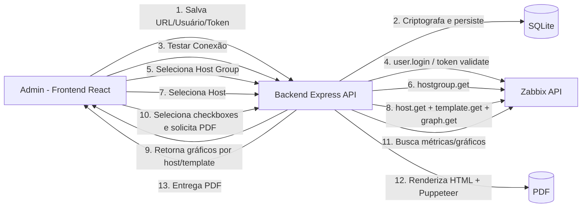

# ZBX Report New

Dashboard de relatórios para Zabbix com configuração dinâmica por interface, seleção inteligente de gráficos e geração de PDF.

## Arquitetura proposta

### Fluxo entre camadas

1. **Frontend (React + Tailwind)**
   - Tela “Configurações de Instância” para URL, usuário e token/senha.
   - Botão **Testar Conexão** chama `/api/settings/test-connection`.
   - Fluxo de seleção: Host Group → Host → lista de gráficos com checkbox.
   - Solicita geração de PDF com os gráficos escolhidos.

2. **Backend (Node.js + Express)**
   - Camada `routes` para endpoints HTTP.
   - Camada `services` para integração com Zabbix JSON-RPC.
   - Camada `db` para persistência segura da configuração.
   - Serviço de relatório para montar HTML e gerar PDF via Puppeteer.

3. **Zabbix API**
   - Métodos principais: `hostgroup.get`, `host.get`, `template.get`, `graph.get`, `item.get`.
   - Validação inicial por `apiinfo.version` + chamada autenticada.

## Persistência leve sugerida

### SQLite (recomendado para MVP)

- Tabela única `instance_settings` com versão e timestamps.
- Criptografia em repouso para segredo (`token_enc`) com chave em variável de ambiente.
- Fácil backup e operação local em Docker.

Schema base (incluído em `backend/src/db.js`):

- `id`
- `name`
- `zabbix_url`
- `username`
- `token_enc`
- `auth_type` (`token` ou `password`)
- `created_at`, `updated_at`

### Redis (opcional)

- Útil para cache de host groups/hosts/graphs e sessões.
- Não ideal como base principal de configuração sem estratégia de persistência (AOF/RDB).

## Estrutura inicial

- `docker-compose.yml` para ambiente de desenvolvimento.
- Backend Express com:
  - Teste de conexão com Zabbix.
  - Listagem de gráficos por host (incluindo templates vinculados).
- Frontend com serviço API e componente base para configuração.
